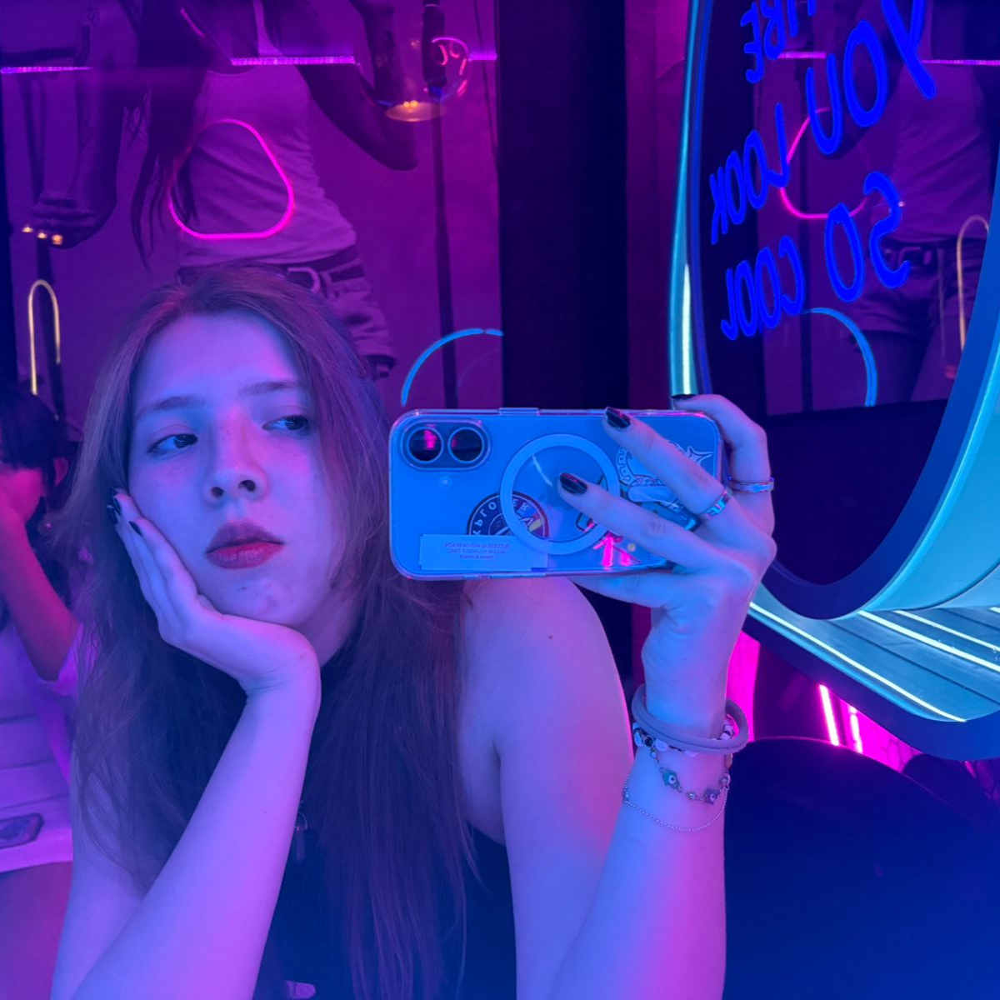

# Primer Proyecto Introducción al Desarrollo Web
## Plataforma para managers de música
**Integrantes**
* Mariana Aguayo
* Kyrie Flores Absalón
* Solange Lejeune Tomao
---

# Plataforma para Managers de Música

## Resumen del producto

El proyecto consiste en el desarrollo de una aplicación web orientada a la gestión de artistas y conciertos dentro de la industria musical. La plataforma permite a los usuarios visualizar información relevante sobre artistas, consultar eventos, analizar datos de popularidad y navegar entre distintas secciones.

El sistema integra tanto un frontend como un backend. En el frontend se implementa una interfaz responsiva utilizando HTML, CSS, Bootstrap y JavaScript, mientras que el backend fue desarrollado en Python mediante el uso de FastAPI. La aplicación consume datos desde una API, gestiona información de forma dinámica y permite operaciones básicas sobre las entidades principales del sistema.

Asimismo, se incorpora almacenamiento local para persistencia de datos, visualización de información mediante gráficas y un sistema de tema claro y oscuro, lo cual mejora la experiencia de usuario.

---

## Instrucciones para levantar el frontend

1. Clonar el repositorio:

```bash
git clone https://github.com/aguayo-0107/ProyectoIDW.git
````

2. Acceder a la carpeta del proyecto:

```bash
cd ProyectoIDW
```

3. Abrir el proyecto en un editor de código, preferentemente Visual Studio Code.

4. Ejecutar el archivo `index.html` directamente en el navegador o utilizar una extensión como Live Server para una mejor experiencia de desarrollo.

5. Verificar que se cuente con conexión a internet para el correcto consumo de la API.

---

## Instrucciones para levantar el backend

1. Acceder a la carpeta del backend:

```bash
cd python
```

2. Crear un entorno virtual:

```bash
python -m venv venv
```

3. Activar el entorno virtual:

En Windows:

```bash
venv\Scripts\activate
```

En Mac/Linux:

```bash
source venv/bin/activate
```

4. Instalar las dependencias necesarias:

```bash
pip install -r requirements.txt
```

El archivo `requirements.txt` incluye las librerías necesarias para el funcionamiento del backend, entre ellas FastAPI, Uvicorn y Pydantic.

5. Ejecutar el servidor:

```bash
uvicorn main:app --reload
```

6. El servidor se ejecutará en una dirección similar a:

```bash
http://127.0.0.1:8000
```

---

## Enlace a la página web del cliente

[https://musicaidw.site](https://musicaidw.site)

---

## Enlace al health endpoint de la API

Actualmente, el backend desplegado se encuentra en:

[https://proyectoidw.onrender.com](https://proyectoidw.onrender.com)

En caso de implementar un endpoint de verificación, este puede consultarse en:

[https://proyectoidw.onrender.com/health](https://proyectoidw.onrender.com/health)

---

## Sección de autores

### Mariana Aguayo



### Kyrie Flores Absalón


### Solange Lejeune Tomao


---

## Live demo del proyecto

El proyecto puede visualizarse en el siguiente enlace:

[https://musicaidw.site](https://musicaidw.site)

---

## Resolución de dudas del profesor posterior a la presentación


# Puntos extra
## Justificación de la paleta de colores

La selección de colores para esta aplicación no se hizo únicamente con un criterio estético, sino también funcional. Como nuestro proyecto está enfocado en una **plataforma para managers de música**, la interfaz debe transmitir **profesionalismo** pero también **creatividad**, además de mantener una buena legibilidad para mostrar artistas, conciertos, estadísticas y fechas de manera clara. Para cumplir con las especificaciones del proyecto la aplicación debe ser **funcional y visualmente atractiva**+ y contar con un sistema de **tema claro/oscuro persistente**. La paleta esta pensada para adaptarse correctamente a ambos modos.

### Criterios de selección

Al escoger los colores tomamos en cuenta 3 factores principales:

1. La relación entre color e identidad de marca,
2. La percepción que generan en el usuario,
3. La accesibilidad visual dentro de una interfaz digital.

En diseño de interfaces, el color influye en la forma en que el usuario interpreta un producto. Algunos tonos transmiten confianza y orden, mientras que otros aportan energía, creatividad o dinamismo. Además, un buen contraste entre fondo y texto mejora la lectura y hace más cómoda la navegación.

### Relación con el rubro musical

Dentro del sector musical, muchas plataformas digitales utilizan combinaciones de **fondos oscuros con acentos vibrantes** como por ejemplo Spotify, ya que esto ayuda a resaltar el contenido visual, crear una experiencia más inmersiva y proyectar una estética moderna. En nuestro caso, como la aplicación está orientada a managers de música, era importante que la interfaz no se viera ni demasiado seria ni demasiado informal.

Por esta razón, se eligió una paleta que combina tonos creativos con colores tecnológicos y neutros, permitiendo representar tanto la parte artística del mundo musical como la parte organizativa y analítica del trabajo de management.

### Paleta propuesta

Por esto mismo la eleccion final de colores para nuestra plataforma fue:

- **Morado principal:** `#6D28D9`
- **Azul secundario:** `#2563EB`
- **Naranja de acento:** `#F97316`
- **Grafito / fondo oscuro:** `#111827`
- **Blanco suave / fondo claro:** `#F9FAFB`
- **Gris pizarra:** `#374151`

### Morado principal — `#6D28D9`

El morado se eligió como color principal porque se asocia con la **creatividad**, la **innovación** y el ámbito artístico. Como la aplicación está relacionada con la industria musical, este color ayuda a representar el lado más creativo y dinámico del proyecto. También aporta una identidad visual más distintiva que otros colores más genéricos.

La idea es usarlo en:
- encabezados,
- botones principales,
- elementos destacados de la interfaz.

### Azul secundario — `#2563EB`

El azul complementa al morado aportando una sensación de **confianza**, **orden** y **profesionalismo**. Es un color muy utilizado en productos digitales porque transmite estabilidad y funciona bien en entornos donde también hay datos, gráficas y elementos de gestión.

Este color va a usarse en:
- enlaces,
- botones secundarios,
- filtros,
- elementos interactivos,
- gráficas o componentes visuales.

### Naranja de acento — `#F97316`

El naranja se eligió como color de acento porque comunica **energía**, **movimiento** y **acción**, cualidades muy relacionadas con conciertos, eventos en vivo y actividad constante. Además, sirve para dirigir visualmente la atención del usuario hacia acciones importantes dentro de la plataforma.

La idea es usarlo en:
- botones de llamada a la acción,
- alertas,
- etiquetas importantes,
- elementos que deban resaltar de inmediato.

### Grafito — `#111827`

El grafito funciona como color base para el **modo oscuro**. Se prefirió en lugar del negro puro porque mantiene una apariencia elegante y moderna, pero al mismo tiempo reduce la fatiga visual. También permite que los colores de acento resalten mejor sin generar un contraste demasiado agresivo.

### Blanco suave — `#F9FAFB`

Para el **modo claro** se eligió un blanco suave en lugar de blanco absoluto, ya que esto hace que la interfaz sea más cómoda visualmente. Este tono conserva limpieza y claridad, pero evita el exceso de brillo en pantalla.

### Gris pizarra — `#374151`

El gris pizarra sirve como color de apoyo para texto secundario, bordes, separadores y elementos menos protagónicos. Ayuda a mantener una jerarquía visual ordenada y a que la interfaz no dependa únicamente de colores intensos.

### Aplicación en tema claro y oscuro

Como el proyecto requiere implementar un tema claro/oscuro persistente, la paleta fue pensada para funcionar bien en ambos casos.

#### Modo oscuro
- **Fondo principal:** `#111827`
- **Texto principal:** `#F9FAFB`
- **Acentos:** morado y naranja

#### Modo claro
- **Fondo principal:** `#F9FAFB`
- **Texto principal:** `#111827`
- **Acentos:** azul y morado

### Conclusión

La paleta de colores que escogimos busca reflejar: una plataforma profesional de gestión dentro del mundo de la música. El **morado** aporta creatividad e identidad, el **azul** refuerza confianza y estructura, el **naranja** introduce dinamismo y acción, y los tonos **neutros** aseguran legibilidad y equilibrio visual. Todos estos colores permiten construir una interfaz moderna, atractiva y funcional, alineada tanto con el rubro musical como con los requerimientos técnicos del proyecto.
